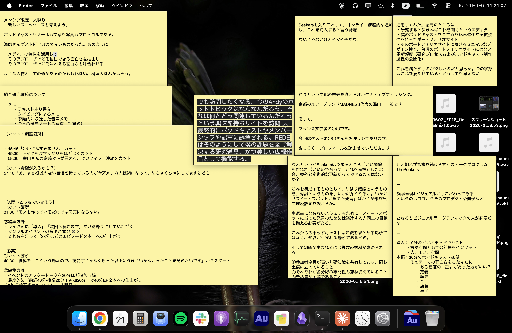

【2026/6/21　ノート】

claudeを使用して僕用のリサーチノートを作った。
僕のインプットは非常に雑多である。ゆえに今はオブシディアンだけでは足りず、以前と変わらずスティッキーズを使ってしまっている。しかしスティッキーズはなにぶん出来ることの幅が狭すぎる。

ゆえに1日分のノートを雑多に書き出して、これを[[デジタルガーデン|Obsidianに統合する]]という運用がいいのではと思いこれを作るに至った。
試しにスティッキーズたちのスクショ画像を貼ってみる。

うーんどうやら見られないようだ。ここは要改善

次にポッドキャストエピソードのリンクを貼ってみる

https://open.spotify.com/episode/3Yw48GwG3XXurfaPxAxOnd

これは僕の番組でなくても無事に貼ることができた。

https://open.spotify.com/embed/show/1EjsDlGdwwEDc1xsNxpEAP

番組ページを貼ることもできるようになった

https://tabelog.com/hokkaido/A0101/A010102/1000122/

うんリンクも生きているようである。